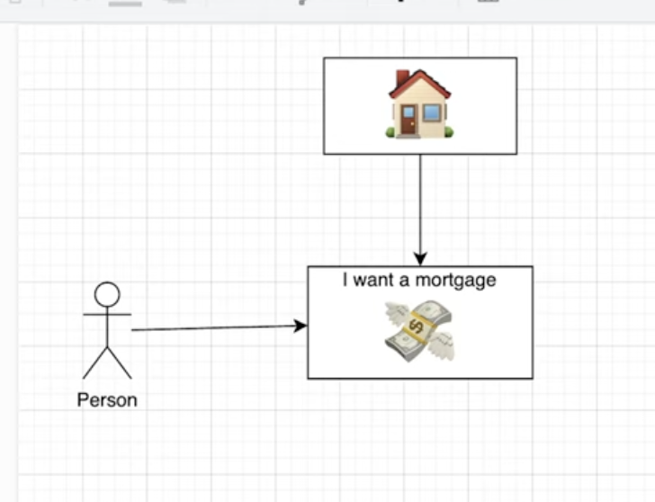

# 🏠 Can I Haz Houze? 

> *A mortgage approval app so smart, even your credit score gets jealous* 🤖💳

Welcome to the ultimate .NET Aspire-powered mortgage approval system! This baby combines document management, ledger tracking, and AI-powered analysis to make mortgage approvals as smooth as butter on hot toast. 🧈🔥

## 🎬 Watch This First!

[](https://youtu.be/FjfPg8VdgfA)

> **This video explains EVERYTHING you need to know!**  
> 👉 Click above to get the full tour, setup, and pro tips in action!  
> _Don't miss it before you start!_ 🎉

## 🚀 What's Inside This Magical Box?

- **🏢 AppHost**: The orchestrator that keeps everyone in line
- **📄 Document Service**: Where your PDFs go to get analyzed by AI 
- **📊 Ledger Service**: Tracks your financial shenanigans
- **🏦 Mortgage Approver**: The final boss that says "yes" or "no"
- **🎫 CRM Service**: Manage customer complaints and support workflows
- **🌐 Web Frontend**: Pretty UI for humans to click buttons
- **🤖 Azure OpenAI Integration**: Because humans are terrible at reading documents
- **🔌 MCP Server Support**: Model Context Protocol for AI assistant integration
- **🎯 AI Agent Workbench**: Build and manage AI agents with Semantic Kernel

## 🛠️ Prerequisites

Before you can haz houze, you need:

- [.NET 9.0 SDK](https://dotnet.microsoft.com/download) 📦
- [Docker Desktop](https://www.docker.com/products/docker-desktop) 🐳
- [Azure CLI](https://docs.microsoft.com/en-us/cli/azure/install-azure-cli) ☁️
- [Azure Developer CLI (azd)](https://learn.microsoft.com/en-us/azure/developer/azure-developer-cli/install-azd) ⚡
- An IDE that doesn't make you cry ([VS 2022](https://visualstudio.microsoft.com/), [Rider](https://www.jetbrains.com/rider/), or [VS Code](https://code.visualstudio.com/)) 💻

## 🏃‍♂️ Quick Start (The Fun Part!)

### 1. Clone & Navigate 📂
```bash
git clone https://github.com/yourusername/can-i-haz-houze.git
cd can-i-haz-houze/src
```

### 2. Set Up Your Secrets (Shh! 🤫)

#### For Local Development with Azure OpenAI:
```bash
cd CanIHazHouze.AppHost
dotnet user-secrets set "ConnectionStrings:openai" "Endpoint=https://your-openai-resource.openai.azure.com/;ApiKey=your-super-secret-key"
```

#### Alternative: Use Environment Variables (if you're into that)
```bash
export ConnectionStrings__openai="Endpoint=https://your-openai-resource.openai.azure.com/;ApiKey=your-key"
```

### 3. Launch the Beast 🐉
```bash
dotnet run --project CanIHazHouze.AppHost
```

Then open your browser to the Aspire dashboard (usually `https://localhost:17001`) and watch the magic happen! ✨

## 🤖 Azure OpenAI Configuration Guide

### Option A: Use Existing Azure OpenAI Resource

1. **Get your Azure OpenAI details**: 
   - Endpoint: `https://your-resource.openai.azure.com/`
   - API Key: From Azure Portal → Your OpenAI Resource → Keys and Endpoint

2. **Set the connection string**:
   ```bash
   cd src/CanIHazHouze.AppHost
   dotnet user-secrets set "ConnectionStrings:openai" "Endpoint=https://your-resource.openai.azure.com/;ApiKey=your-key-here"
   ```

### Option B: Create New Azure OpenAI Resource

```bash
# Login to Azure (if you haven't already)
az login

# Create resource group
az group create --name rg-canihazhouze --location eastus2

# Create Azure OpenAI resource
az cognitiveservices account create \
  --name openai-canihazhouze \
  --resource-group rg-canihazhouze \
  --kind OpenAI \
  --sku S0 \
  --location eastus2

# Deploy GPT-4o-mini model
az cognitiveservices account deployment create \
  --name openai-canihazhouze \
  --resource-group rg-canihazhouze \
  --deployment-name gpt-4o-mini \
  --model-name gpt-4o-mini \
  --model-version "2024-07-18" \
  --model-format OpenAI \
  --sku-capacity 10 \
  --sku-name Standard
```

## ☁️ Deploy to Azure with Azure Developer CLI (azd)

### First Time Setup 🎬
```bash
# Initialize Azure Developer CLI in your project
azd init

# Follow the prompts:
# - Choose "Use code in the current directory" 
# - App name: can-i-haz-houze
# - Environment: dev (or whatever you fancy)

# Login to Azure
azd auth login

# Deploy everything (grab some coffee ☕, this takes a few minutes)
azd up
```

### 🤖 Automatic Post-Deployment Setup (NEW!)

After running `azd up`, the system **automatically** performs post-deployment configuration! 

The post-deploy hook will:
- 🌐 Enable public network access on Storage Account and Cosmos DB (for development/testing)
- 🔍 Find your deployed Azure OpenAI resource
- 🔑 Retrieve the endpoint and API key
- 🔐 Configure your local user secrets automatically
- ✅ Make your app ready for local development

**No manual configuration needed!** Just run `azd up` and then `dotnet run --project src/CanIHazHouze.AppHost` locally.

### Manual OpenAI Setup (If Needed) 🛠️

If the automatic setup doesn't work or you want to run it manually:

```bash
# Run just the post-deploy hook
azd hooks run postdeploy

# Or get connection details manually (old way)
# See the "Get Connection Details After Deployment" section below
```

### Subsequent Deployments 🔄
```bash
# Deploy code changes
azd deploy

# Or provision + deploy everything
azd up
```

### Useful azd Commands 📋
```bash
azd monitor         # Open Azure portal monitoring
azd logs            # Stream logs from Azure
azd down            # Tear down Azure resources (💸 money saver!)
azd env list        # List environments
azd env select      # Switch environments
```

### Get Connection Details After Deployment 🔍
⚠️ **Note**: With the new automatic setup, you usually don't need to do this manually!

The automatic post-deploy hook should configure everything for you. But if you need to get the details manually:

```bash
# Get the resource group name (usually rg-<app-name>)
az group list --query "[?contains(name, 'can-i-haz-houze')].name" -o tsv

# Set variables (replace with your actual values)
RESOURCE_GROUP="rg-can-i-haz-houze-dev"  # from above command
OPENAI_SERVICE_NAME="openai-can-i-haz-houze"  # your OpenAI resource name

# Get the endpoint
az cognitiveservices account show \
  --name $OPENAI_SERVICE_NAME \
  --resource-group $RESOURCE_GROUP \
  --query properties.endpoint \
  --output tsv

# Get the API key
az cognitiveservices account keys list \
  --name $OPENAI_SERVICE_NAME \
  --resource-group $RESOURCE_GROUP \
  --query key1 \
  --output tsv

# Set user secrets manually (if automatic setup failed)
cd src/CanIHazHouze.AppHost
dotnet user-secrets set "ConnectionStrings:openai" "Endpoint=<endpoint>;ApiKey=<key>"
```

💡 **Pro Tip**: For production apps deployed with `azd`, the connection is automatically configured using managed identity - no manual connection string needed!

## 🎯 Key Features

### Automated DevOps Experience 🤖
- **One-Command Deploy**: `azd up` deploys everything to Azure
- **Auto-Configuration**: OpenAI connection automatically configured for local development
- **Cross-Platform Scripts**: Works on macOS and Linux (requires bash)
- **Zero Manual Setup**: No need to copy/paste connection strings

### MCP (Model Context Protocol) Support 🔌
- **AI Assistant Integration**: Connect Claude Desktop and other AI tools directly
- **20+ MCP Tools**: Complete API access via standardized protocol across all services
- **Real-time Communication**: WebSocket-based protocol with JSON-RPC 2.0
- **Parallel REST APIs**: MCP and REST APIs work simultaneously
- **Built-in Documentation**: `/mcp/capabilities` endpoint for tool discovery
- 📖 **[MCP Setup Guide →](docs/tutorials/MCP_SETUP.md)** | **[MCP Usage Guide →](docs/guides/MCP_USAGE_GUIDE.md)**

### Document Service 📄
- **Upload documents** with drag & drop
- **AI-powered analysis** extracts metadata automatically
- **Smart tagging** suggestions (because humans forget things)
- **Tag enhancement** for existing documents
- **Mortgage document verification** (income, credit, employment, appraisal)

### Ledger Service 📊
- Track financial transactions
- Mortgage calculation helpers
- Integration with document verification

### Mortgage Approver 🏦
- Automated approval workflow
- Document verification checks
- AI-assisted decision making

### CRM Service 🎫
- Customer complaint management
- Comment threads for support conversations
- Approval workflows for complaint resolution
- Recent complaints tracking across all customers

## 🤖 AI Assistant Integration

CanIHazHouze supports **Model Context Protocol (MCP)** for seamless AI assistant integration with Claude Desktop, GitHub Copilot, and other AI tools!

### Quick MCP Setup

```bash
# 1. Start the application
dotnet run --project src/CanIHazHouze.AppHost

# 2. Configure your AI assistant (example for Claude Desktop)
# Add to claude_desktop_config.json:
{
  "mcpServers": {
    "canihazhouze": {
      "command": "websocket",
      "args": ["ws://localhost:5001/mcp"]
    }
  }
}
```

### Available MCP Capabilities
- 🏦 **Financial Management**: Check balances, process transactions, view history
- 📄 **Document Processing**: Upload, analyze, and verify mortgage documents  
- 🏠 **Mortgage Applications**: Create, update, and track application status
- 🎫 **CRM Management**: Create, update, and manage customer complaints
- 🔗 **Cross-Service Integration**: Automated verification across all services

📚 **Learn More**: [MCP Setup Guide](docs/tutorials/MCP_SETUP.md) | [MCP Usage Guide](docs/guides/MCP_USAGE_GUIDE.md) | [MCP Implementation Details](docs/technical/MCP_IMPLEMENTATION.md)

## 🤖 AI Agent Workbench

Build sophisticated AI agents with Microsoft Semantic Kernel! The Agent Workbench provides a complete platform for creating, configuring, and managing AI agents powered by Azure OpenAI.

### ✨ Highlights

- 🎯 **Agent Management** - Create and edit AI agents with custom prompts
- 🔄 **Multi-Turn Conversations** - Agents work iteratively towards defined goals
- 🤖 **Multiple Models** - GPT-4o, GPT-4o Mini, GPT-3.5 Turbo, GPT-4 Turbo
- 🔧 **Tool Integration** - Connect to Ledger, CRM, and Documents APIs
- 🎛️ **Background Processing** - Run agents asynchronously with pause/resume/cancel
- 📊 **Live Monitoring** - Real-time dashboard with conversation tracking

### 🚀 Quick Start

```bash
# Start the app
dotnet run --project src/CanIHazHouze.AppHost

# Navigate to "🤖 Agent Workbench" in the sidebar
# Create your first agent and start building!
```

📚 **Learn More**: [Agent Workbench Guide](docs/guides/AGENT_WORKBENCH.md) - Complete walkthrough with screenshots and examples

### 🔌 API Documentation for Azure AI Foundry

Build AI agents with our comprehensive API documentation! Navigate to `/api-docs` for:

- 📋 **OpenAPI Specifications** - Ready-to-use API specs for all services
- 🤖 **System Prompts** - Pre-configured prompts for Mortgage, Document, Ledger, and CRM agents
- 📋 **Copy to Clipboard** - One-click copying for Azure AI Foundry setup
- 🚀 **Production Ready** - Dynamic URL resolution for development and production

📚 **Learn More**: [API Documentation Implementation](docs/technical/API_DOCUMENTATION_PAGE_IMPLEMENTATION.md)

## 🔧 Development Tips

### Why No Aspire CLI? 🤔
You might see references to the `aspire` CLI in other tutorials. It's a preview tool that's just a convenience wrapper around `dotnet run` - it automatically finds your AppHost project. Since our project structure is clear and we're already using standard .NET commands, we don't need it! 

> *"Keep it simple, stupid!"* - Some wise developer probably 🧠

### Running Individual Services 🎪
```bash
# Just the document service
dotnet run --project CanIHazHouze.DocumentService

# Just the web frontend  
dotnet run --project CanIHazHouze.Web
```

### Debugging Like a Pro 🕵️
- Use the Aspire dashboard to monitor all services
- Check individual service logs in the dashboard
- Use `dotnet user-secrets list` to verify your secrets

### Database Management 🗄️
- Cosmos DB Emulator runs automatically in Docker
- Data Explorer available at: `https://localhost:8081/_explorer/index.html`
- Local data persists in Docker volumes

## 🆘 Troubleshooting

### "Object reference not set to an instance of an object" 🐛
- Check your OpenAI connection string is set correctly
- Verify all required services are running
- Make sure Docker is running (for Cosmos DB emulator)

### Currency Shows "¤" Symbol Instead of "$" 💱
This happens when the server culture isn't set to US/USD on Azure deployment. The "¤" is a generic currency symbol.

**Quick Fix**: Update your `Program.cs` files to set the culture:
```csharp
// Add this after var builder = WebApplication.CreateBuilder(args);
using System.Globalization;

// Set culture to US for consistent currency formatting
var culture = new CultureInfo("en-US");
CultureInfo.DefaultThreadCurrentCulture = culture;
CultureInfo.DefaultThreadCurrentUICulture = culture;
```

**Alternative**: Use explicit formatting in Razor components:
```csharp
// Instead of: @amount.ToString("C")
// Use: @amount.ToString("C", CultureInfo.CreateSpecificCulture("en-US"))
```

### Azure OpenAI Connection Issues 🔌
- Verify your endpoint URL doesn't have trailing slashes
- Check your API key is valid and has proper permissions
- Ensure your Azure OpenAI resource has the required model deployed

### azd Deployment Fails 💥
- Run `azd auth login` to refresh authentication
- Check Azure subscription permissions
- Verify resource naming doesn't conflict with existing resources

## 📚 Documentation

All documentation has been organized into a comprehensive hub! Visit **[docs/README.md](docs/README.md)** for the complete documentation index.

### 🎓 Quick Links

**Getting Started**
- [📖 Documentation Hub](docs/README.md) - Complete documentation index
- [🤖 Local OpenAI Setup](docs/tutorials/LOCAL_OPENAI_SETUP.md) - Configure Azure OpenAI for local development
- [🔌 MCP Setup Guide](docs/tutorials/MCP_SETUP.md) - Set up AI assistant integration
- [🐳 Devcontainer Setup](docs/tutorials/devcontainer-setup.md) - GitHub Codespaces configuration

**Feature Guides**
- [🤖 Agent Workbench Guide](docs/guides/AGENT_WORKBENCH.md) - Build AI agents with Semantic Kernel
- [🔌 MCP Usage Guide](docs/guides/MCP_USAGE_GUIDE.md) - Use MCP with AI assistants
- [🏦 Mortgage Approver Guide](docs/guides/mortgage-approver-guide.md) - Mortgage approval workflow
- [🎫 CRM Service Guide](docs/guides/crm-service-guide.md) - Customer relationship management
- [💡 Usage Examples](docs/guides/USAGE_EXAMPLES.md) - Frontend features and patterns

**Technical Deep Dives**
- [🤖 Azure OpenAI Integration](docs/technical/AZURE_OPENAI_INTEGRATION.md) - Technical implementation details
- [🌌 Aspire Cosmos DB Configuration](docs/technical/ASPIRE_COSMOS_DB_CONFIGURATION.md) - Database setup
- [🔌 MCP Implementation](docs/technical/MCP_IMPLEMENTATION.md) - MCP server architecture
- [⚡ Frontend Performance](docs/technical/FRONTEND_PERFORMANCE_IMPROVEMENTS.md) - UI optimizations

### 📂 Documentation Structure

```
docs/
├── 📖 README.md              # Documentation hub (START HERE!)
├── 🎓 tutorials/             # Setup and getting started guides
│   ├── LOCAL_OPENAI_SETUP.md
│   ├── MCP_SETUP.md
│   └── devcontainer-setup.md
├── 📖 guides/                # Feature guides and how-tos
│   ├── AGENT_WORKBENCH.md
│   ├── MCP_USAGE_GUIDE.md
│   ├── mortgage-approver-guide.md
│   └── crm-service-guide.md
└── 🔧 technical/             # Implementation details and architecture
    ├── AZURE_OPENAI_INTEGRATION.md
    ├── MCP_IMPLEMENTATION.md
    └── ASPIRE_COSMOS_DB_CONFIGURATION.md
```

## 🔗 Useful Links

- [.NET Aspire Documentation](https://learn.microsoft.com/en-us/dotnet/aspire/) 📖
- [Azure Developer CLI Docs](https://learn.microsoft.com/en-us/azure/developer/azure-developer-cli/) ⚡
- [Azure OpenAI Service](https://azure.microsoft.com/en-us/products/cognitive-services/openai-service) 🤖
- [Cosmos DB Documentation](https://docs.microsoft.com/en-us/azure/cosmos-db/) 🌌

## 🤝 Contributing

Found a bug? Want to add a feature? PRs welcome! Just remember:
- Write tests (your future self will thank you)
- Follow the existing code style (be consistent, unlike your commit messages)
- Update this README if you add cool new features

## 📄 License

MIT License - because sharing is caring! 💕

---

*Made with ❤️ and lots of ☕ by developers who believe everyone deserves a house*

**Happy House Hunting! 🏠🔍**
