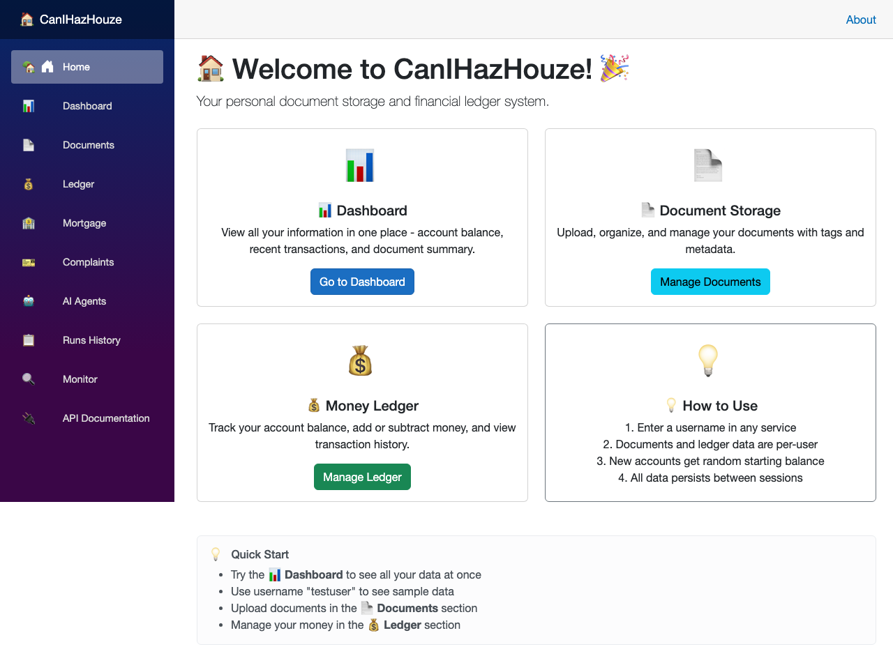
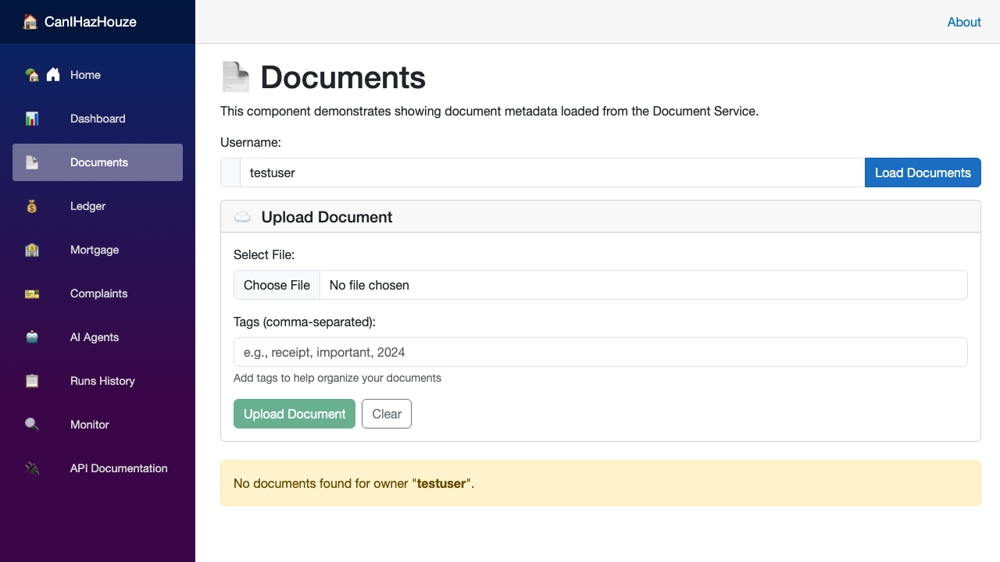

# Can I Haz Houze 🏠

Can I Haz Houze is a .NET 9 + .NET Aspire mortgage platform with multiple services for:
- document intake and AI analysis,
- financial ledger tracking,
- mortgage approval orchestration,
- CRM complaint handling,
- and a Blazor web frontend.

This repository has been simplified to focus on **how the system works**, especially the **document workflow**.

## Start Here (Learning Path)

1. Read **[docs/DOCUMENT_WORKFLOW.md](docs/DOCUMENT_WORKFLOW.md)** for the end-to-end document lifecycle.
2. Read service docs in `src/*/README.md` for implementation details.
3. Use **/api-docs** in the running app for OpenAPI + system prompt copy/paste.

## Quick Start

### Prerequisites
- .NET 9 SDK
- Docker Desktop
- Azure CLI (`az`)
- Azure Developer CLI (`azd`)

### 1) Configure Azure OpenAI endpoint (keyless auth)

> Use `DefaultAzureCredential` (`az login`), not API keys.

```bash
az login
OPENAI_ENDPOINT="Endpoint=https://your-resource.openai.azure.com/"
for p in CanIHazHouze.AppHost CanIHazHouze.AgentService CanIHazHouze.DocumentService CanIHazHouze.Tests; do
  (cd "src/$p" && dotnet user-secrets set "ConnectionStrings:openai" "$OPENAI_ENDPOINT")
done
```

### 2) Run the full app

```bash
cd src
dotnet run --project CanIHazHouze.AppHost
```

Then open the Aspire dashboard (usually `https://localhost:17001`).

### 3) Build and test

```bash
cd src
dotnet build
dotnet test
```

## System at a Glance

| Service | Responsibility |
| --- | --- |
| AppHost | Orchestrates all services and local dependencies |
| DocumentService | Uploads, stores, analyzes, and verifies mortgage documents |
| LedgerService | Financial account and transaction operations |
| MortgageApprover | Mortgage request state + approval/rejection logic |
| CrmService | Customer complaints workflow |
| AgentService | AI agent orchestration/workbench |
| Web | Blazor UI for all workflows |

## Webfrontend Screenshots

### Home


### Documents


### Agents


## Document Workflow (Short Version)

1. User uploads a document (UI/API/MCP).
2. File is stored in Azure Blob Storage (or Azurite locally).
3. Metadata is stored in Cosmos DB.
4. Azure OpenAI can analyze content (classification, summary, tags, entities).
5. MortgageApprover uses document verification status during application evaluation.
6. Documents can be listed, tagged, downloaded, or deleted.

For full details and examples, see **[docs/DOCUMENT_WORKFLOW.md](docs/DOCUMENT_WORKFLOW.md)**.

## Deploy to Azure

```bash
azd up      # provision + deploy
azd deploy  # deploy code changes
azd down    # tear down
```

## Documentation Map

- **Core onboarding**: this README
- **Document deep dive**: [docs/DOCUMENT_WORKFLOW.md](docs/DOCUMENT_WORKFLOW.md)
- **Service behavior**: [src/CanIHazHouze.MortgageApprover/README.md](src/CanIHazHouze.MortgageApprover/README.md)
- **Production**: [docs/PRODUCTION_DEPLOYMENT_GUIDE.md](docs/PRODUCTION_DEPLOYMENT_GUIDE.md)
- **MCP usage**: [src/MCP_USAGE_GUIDE.md](src/MCP_USAGE_GUIDE.md)
- **MCP setup for Copilot**: [.github/MCP_SETUP.md](.github/MCP_SETUP.md)
- **Agent prompts**: [docs/PROMPTS.md](docs/PROMPTS.md)
- **CRM testing flow**: [docs/TESTING_GUIDE_CRM.md](docs/TESTING_GUIDE_CRM.md)
- **All repo guides**: [docs/README.md](docs/README.md)

Historical implementation-summary docs were consolidated into the guides above to keep onboarding simpler.
