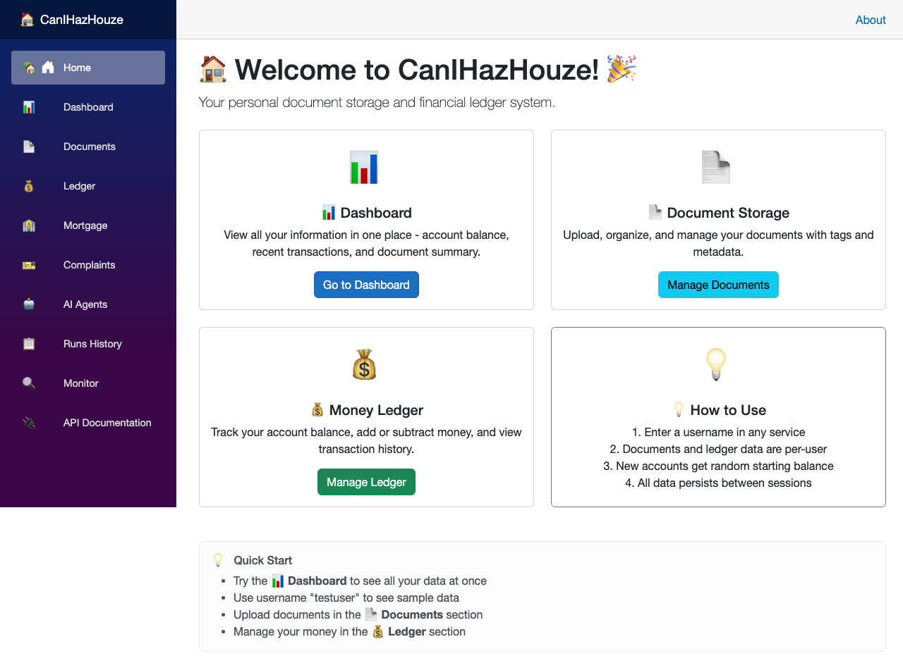
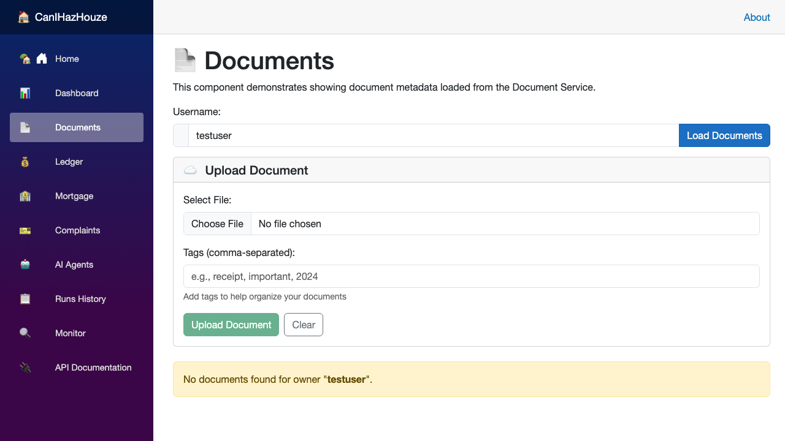
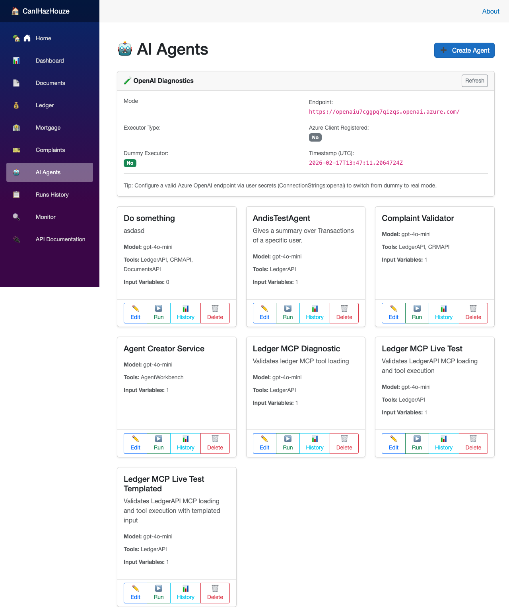

# Can I Haz Houze 🏠

At its core, this is a **microservice application** built with **.NET Aspire** and a **Blazor web interface** where the different application functions can be used — document intake & AI analysis, financial ledger tracking, mortgage approval orchestration, CRM complaint handling, and more.

**BUT** that's just the (boring) surface. Here's what makes it interesting:

- 🔌 **MCP everywhere** — Every API also exposes a [Model Context Protocol](src/MCP_USAGE_GUIDE.md) endpoint. Add them to VS Code and let Copilot read & modify data directly.
- 🤖 **Agent Workbench** — Create a simple prompt-based agent, assign tools, and let it work autonomously.
- 📡 **Best-practice observability** — End-to-end distributed tracing across all services, all the way into Azure OpenAI calls.
- 🖥️ **Real-time Agent Monitor** — Watch tool calls your agent makes as they happen, in real time.
- 🏢 **No AI Foundry required** — This demo works for customers who can't (or don't want to) use AI Foundry or similar managed platforms.

> [!CAUTION]
> **The deployed website and all APIs have NO authentication.** Anyone with the URL can access and modify data. **Run `azd down` as soon as you're done** to tear down the Azure resources and avoid exposing unprotected endpoints.

## Start Here (Learning Path)

1. Read **[docs/DOCUMENT_WORKFLOW.md](docs/DOCUMENT_WORKFLOW.md)** for the end-to-end document lifecycle.
2. Read service docs in `src/*/README.md` for implementation details.
3. Use **/api-docs** in the running app for OpenAPI + system prompt copy/paste.

## Documentation Map

- **Core onboarding**: this README
- **Document deep dive**: [docs/DOCUMENT_WORKFLOW.md](docs/DOCUMENT_WORKFLOW.md)
- **Service behavior**: [src/CanIHazHouze.MortgageApprover/README.md](src/CanIHazHouze.MortgageApprover/README.md)
- **Production**: [docs/PRODUCTION_DEPLOYMENT_GUIDE.md](docs/PRODUCTION_DEPLOYMENT_GUIDE.md)
- **MCP usage**: [src/MCP_USAGE_GUIDE.md](src/MCP_USAGE_GUIDE.md)
- **MCP setup for Copilot**: [.github/MCP_SETUP.md](.github/MCP_SETUP.md)
- **Agent prompts**: [docs/PROMPTS.md](docs/PROMPTS.md)
- **CRM testing flow**: [docs/TESTING_GUIDE_CRM.md](docs/TESTING_GUIDE_CRM.md)
- **All repo guides**: [docs/README.md](docs/README.md)
- 🎬 **Video: Adding these APIs to AI Foundry**: [https://youtu.be/FjfPg8VdgfA](https://youtu.be/FjfPg8VdgfA)

## Quick Start

### Prerequisites
- .NET 9 SDK
- Docker Desktop
- Azure CLI (`az`)
- Azure Developer CLI (`azd`)

### 1) Configure Azure OpenAI endpoint (keyless auth)

> Use `DefaultAzureCredential` (`az login`), not API keys.

```bash
az login
OPENAI_ENDPOINT="Endpoint=https://your-resource.openai.azure.com/"
for p in CanIHazHouze.AppHost CanIHazHouze.AgentService CanIHazHouze.DocumentService CanIHazHouze.Tests; do
  (cd "src/$p" && dotnet user-secrets set "ConnectionStrings:openai" "$OPENAI_ENDPOINT")
done
```

### 2) Run the full app

```bash
cd src
dotnet run --project CanIHazHouze.AppHost
```

Then open the Aspire dashboard (usually `https://localhost:17001`).

### 3) Build and test

```bash
cd src
dotnet build
dotnet test
```

## System at a Glance

| Service | Responsibility |
| --- | --- |
| AppHost | Orchestrates all services and local dependencies |
| DocumentService | Uploads, stores, analyzes, and verifies mortgage documents |
| LedgerService | Financial account and transaction operations |
| MortgageApprover | Mortgage request state + approval/rejection logic |
| CrmService | Customer complaints workflow |
| AgentService | AI agent orchestration/workbench |
| Web | Blazor UI for all workflows |

## Webfrontend Screenshots

### Home


### Documents


### Agents


## Document Workflow (Short Version)

1. User uploads a document (UI/API/MCP).
2. File is stored in Azure Blob Storage (or Azurite locally).
3. Metadata is stored in Cosmos DB.
4. Azure OpenAI can analyze content (classification, summary, tags, entities).
5. MortgageApprover uses document verification status during application evaluation.
6. Documents can be listed, tagged, downloaded, or deleted.

For full details and examples, see **[docs/DOCUMENT_WORKFLOW.md](docs/DOCUMENT_WORKFLOW.md)**.

## Deploy to Azure

```bash
azd up      # provision + deploy
azd deploy  # deploy code changes
azd down    # tear down
```


