# 📚 Can I Haz Houze - Documentation Hub

Welcome to the complete documentation for the Can I Haz Houze mortgage approval system! This documentation is organized into three main categories to help you find what you need quickly.

## 🎓 Tutorials & Setup Guides

Get started with the basics! These guides will help you set up and configure the application.

### Essential Setup
- **[Local OpenAI Setup](tutorials/LOCAL_OPENAI_SETUP.md)** 🤖  
  Configure Azure OpenAI for local development with keyless authentication

- **[MCP Server Setup](tutorials/MCP_SETUP.md)** 🔌  
  Set up Model Context Protocol for AI assistant integration (Claude Desktop, GitHub Copilot)

### Development Environment
- **[Devcontainer Setup](tutorials/devcontainer-setup.md)** 🐳  
  Configure GitHub Codespaces and VS Code devcontainer for development

- **[GitHub Workflows](tutorials/github-workflows.md)** ⚙️  
  Understanding CI/CD pipelines and GitHub Actions workflows

## 📖 User Guides & How-Tos

Learn how to use the various features and components of the application.

### AI & Automation
- **[Agent Workbench Guide](guides/AGENT_WORKBENCH.md)** 🤖  
  Build and manage AI agents with Microsoft Semantic Kernel - complete walkthrough with screenshots

- **[MCP Usage Guide](guides/MCP_USAGE_GUIDE.md)** 🔌  
  Using Model Context Protocol tools with AI assistants (Claude, Copilot)

### Service-Specific Guides
- **[Mortgage Approver Guide](guides/mortgage-approver-guide.md)** 🏦  
  Complete guide to the mortgage approval service and its features

- **[Mortgage API Documentation](guides/mortgage-api-documentation.md)** 📋  
  Detailed API reference for the Mortgage Approver service

- **[CRM Service Guide](guides/crm-service-guide.md)** 🎫  
  Customer Relationship Management features and workflows

### Feature Guides
- **[Usage Examples](guides/USAGE_EXAMPLES.md)** 💡  
  Frontend performance features: toast notifications, loading indicators, error boundaries

- **[Visual Testing Guide](guides/VISUAL_TESTING_GUIDE.md)** 🎨  
  Using Playwright for visual regression testing

- **[CRM Testing Guide](guides/TESTING_GUIDE_CRM.md)** 🧪  
  Testing strategies for the CRM service

## 🔧 Technical Documentation

Deep dives into architecture, implementations, and technical decisions.

### Azure & Infrastructure
- **[Azure OpenAI Integration](technical/AZURE_OPENAI_INTEGRATION.md)** 🤖  
  Technical details of Azure OpenAI integration and usage patterns

- **[Aspire Cosmos DB Configuration](technical/ASPIRE_COSMOS_DB_CONFIGURATION.md)** 🌌  
  .NET Aspire configuration for Azure Cosmos DB

- **[Cosmos DB Migration Summary](technical/COSMOS_DB_MIGRATION_SUMMARY.md)** 📊  
  Migration to Azure Cosmos DB with partition key strategy

- **[Azure Blob Storage Migration](technical/AZURE_BLOB_STORAGE_MIGRATION_SUMMARY.md)** 📦  
  Migration from local file storage to Azure Blob Storage

- **[Production Cosmos Example](technical/PRODUCTION_COSMOS_EXAMPLE.md)** 🚀  
  Production deployment patterns for Cosmos DB

### Model Context Protocol (MCP)
- **[MCP Implementation](technical/MCP_IMPLEMENTATION.md)** 🔌  
  Complete MCP server implementation architecture and design

- **[MCP Implementation Summary](technical/MCP_IMPLEMENTATION_SUMMARY.md)** 📝  
  Summary of MCP integration across all services

- **[MCP Migration Summary](technical/MCP_MIGRATION_SUMMARY.md)** 🔄  
  Migration process from REST-only to MCP-enabled services

- **[MCP SDK Migration Complete](technical/MCP_SDK_MIGRATION_COMPLETE.md)** ✅  
  Final SDK migration and standardization

### Feature Implementations
- **[CRM Implementation Summary](technical/CRM_IMPLEMENTATION_SUMMARY.md)** 🎫  
  Complete CRM service implementation details

- **[API Documentation Page](technical/API_DOCUMENTATION_PAGE_IMPLEMENTATION.md)** 📄  
  Implementation of the API documentation page for Azure AI Foundry

- **[Frontend Performance Improvements](technical/FRONTEND_PERFORMANCE_IMPROVEMENTS.md)** ⚡  
  Technical details of frontend optimizations

- **[Agent Workbench Implementation](technical/IMPLEMENTATION_SUMMARY.md)** 🤖  
  Semantic Kernel agent implementation

### Database & Data
- **[Partition Key Update](technical/PARTITION_KEY_UPDATE_SUMMARY.md)** 🔑  
  Cosmos DB partition key strategy updates

- **[Mortgage Container Standardization](technical/MORTGAGE_CONTAINER_STANDARDIZATION.md)** 📦  
  Standardizing container naming and structure

- **[Structured Input Demo](technical/STRUCTURED_INPUT_DEMO.md)** 📋  
  Azure OpenAI structured output patterns

### Build & Testing
- **[Docker Test Results](technical/DOCKER_TEST_RESULTS.md)** 🐳  
  Docker-based testing results and analysis

- **[Build Warnings Analysis](technical/BUILD_WARNINGS_ANALYSIS.md)** ⚠️  
  Analysis and resolution of build warnings

### Development Resources
- **[AI Prompts Collection](technical/PROMPTS.md)** 💬  
  Collection of AI prompts used in development and features

- **[Phase 1 Enhancement Summary](technical/PHASE1_ENHANCEMENT_SUMMARY.md)** 📈  
  First phase of feature enhancements

## 🔍 Quick Navigation

### By Role

```mermaid
graph TD
    Start["👤 Choose Your Path"]
    
    Dev["🎓 New Developer"]
    AI["🤖 AI Integration"]
    Arch["🏗️ Architect"]
    QA["🧪 QA Engineer"]
    PM["💼 Product Manager"]
    
    Start --> Dev
    Start --> AI
    Start --> Arch
    Start --> QA
    Start --> PM
    
    Dev --> Dev1["Local OpenAI Setup"]
    Dev --> Dev2["Main README"]
    Dev --> Dev3["Agent Workbench"]
    
    AI --> AI1["MCP Setup"]
    AI --> AI2["MCP Usage Guide"]
    AI --> AI3["MCP Implementation"]
    
    Arch --> Arch1["Cosmos DB Config"]
    Arch --> Arch2["Azure OpenAI"]
    Arch --> Arch3["MCP Architecture"]
    
    QA --> QA1["Visual Testing"]
    QA --> QA2["CRM Testing"]
    QA --> QA3["Docker Tests"]
    
    PM --> PM1["Agent Workbench"]
    PM --> PM2["CRM Service"]
    PM --> PM3["Mortgage Approver"]
    
    style Start fill:#2d3748,stroke:#4299e1,stroke-width:3px,color:#63b3ed
    style Dev fill:#1a202c,stroke:#48bb78,stroke-width:2px,color:#68d391
    style AI fill:#1a202c,stroke:#9f7aea,stroke-width:2px,color:#b794f4
    style Arch fill:#1a202c,stroke:#ed8936,stroke-width:2px,color:#f6ad55
    style QA fill:#1a202c,stroke:#f56565,stroke-width:2px,color:#fc8181
    style PM fill:#1a202c,stroke:#4299e1,stroke-width:2px,color:#63b3ed
    style Dev1 fill:#2d3748,stroke:#48bb78,color:#68d391
    style Dev2 fill:#2d3748,stroke:#48bb78,color:#68d391
    style Dev3 fill:#2d3748,stroke:#48bb78,color:#68d391
    style AI1 fill:#2d3748,stroke:#9f7aea,color:#b794f4
    style AI2 fill:#2d3748,stroke:#9f7aea,color:#b794f4
    style AI3 fill:#2d3748,stroke:#9f7aea,color:#b794f4
    style Arch1 fill:#2d3748,stroke:#ed8936,color:#f6ad55
    style Arch2 fill:#2d3748,stroke:#ed8936,color:#f6ad55
    style Arch3 fill:#2d3748,stroke:#ed8936,color:#f6ad55
    style QA1 fill:#2d3748,stroke:#f56565,color:#fc8181
    style QA2 fill:#2d3748,stroke:#f56565,color:#fc8181
    style QA3 fill:#2d3748,stroke:#f56565,color:#fc8181
    style PM1 fill:#2d3748,stroke:#4299e1,color:#63b3ed
    style PM2 fill:#2d3748,stroke:#4299e1,color:#63b3ed
    style PM3 fill:#2d3748,stroke:#4299e1,color:#63b3ed
```

**🎓 New Developers**: Start with [tutorials/LOCAL_OPENAI_SETUP.md](tutorials/LOCAL_OPENAI_SETUP.md) → [Main README](../README.md) → [Agent Workbench Guide](guides/AGENT_WORKBENCH.md)

**🤖 AI Integration**: [MCP Setup](tutorials/MCP_SETUP.md) → [MCP Usage Guide](guides/MCP_USAGE_GUIDE.md) → [MCP Implementation](technical/MCP_IMPLEMENTATION.md)

**🏗️ Architects**: [Aspire Cosmos DB Config](technical/ASPIRE_COSMOS_DB_CONFIGURATION.md) → [Azure OpenAI Integration](technical/AZURE_OPENAI_INTEGRATION.md) → [MCP Implementation](technical/MCP_IMPLEMENTATION.md)

**🧪 QA Engineers**: [Visual Testing Guide](guides/VISUAL_TESTING_GUIDE.md) → [CRM Testing Guide](guides/TESTING_GUIDE_CRM.md) → [Docker Test Results](technical/DOCKER_TEST_RESULTS.md)

**💼 Product Managers**: [Agent Workbench Guide](guides/AGENT_WORKBENCH.md) → [CRM Service Guide](guides/crm-service-guide.md) → [Mortgage Approver Guide](guides/mortgage-approver-guide.md)

### By Technology

**🤖 Azure OpenAI**
- [Azure OpenAI Integration](technical/AZURE_OPENAI_INTEGRATION.md)
- [Agent Workbench Guide](guides/AGENT_WORKBENCH.md)
- [Structured Input Demo](technical/STRUCTURED_INPUT_DEMO.md)

**🔌 MCP (Model Context Protocol)**
- [MCP Setup](tutorials/MCP_SETUP.md)
- [MCP Usage Guide](guides/MCP_USAGE_GUIDE.md)
- [MCP Implementation](technical/MCP_IMPLEMENTATION.md)

**🌌 Cosmos DB**
- [Aspire Cosmos DB Configuration](technical/ASPIRE_COSMOS_DB_CONFIGURATION.md)
- [Cosmos DB Migration Summary](technical/COSMOS_DB_MIGRATION_SUMMARY.md)
- [Partition Key Update](technical/PARTITION_KEY_UPDATE_SUMMARY.md)

**🎨 Frontend**
- [Usage Examples](guides/USAGE_EXAMPLES.md)
- [Visual Testing Guide](guides/VISUAL_TESTING_GUIDE.md)
- [Frontend Performance Improvements](technical/FRONTEND_PERFORMANCE_IMPROVEMENTS.md)

**🐳 Docker & DevOps**
- [Devcontainer Setup](tutorials/devcontainer-setup.md)
- [GitHub Workflows](tutorials/github-workflows.md)
- [Docker Test Results](technical/DOCKER_TEST_RESULTS.md)

## 📞 Need Help?

- **Getting Started**: Check the [main README](../README.md) for quick start instructions
- **Video Tutorial**: Watch our [complete walkthrough](https://youtu.be/FjfPg8VdgfA) 🎬
- **Issues**: Report bugs or request features on [GitHub Issues](https://github.com/abossard/can-i-haz-houze/issues)

---

*Documentation maintained with ❤️ by the Can I Haz Houze team*
