# Can I Haz Houze - Architecture Documentation

> A mortgage approval system built with .NET 9.0 and .NET Aspire 9.3.1

## High-Level Architecture Overview

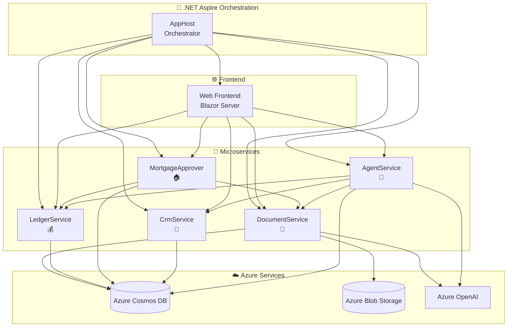

## Project Structure

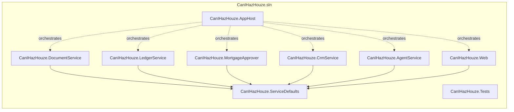

## Service Details

### ServiceDefaults (Shared Library)

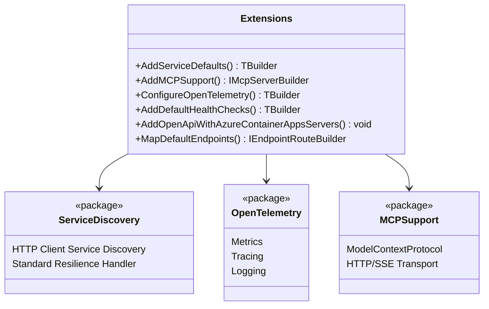

### DocumentService

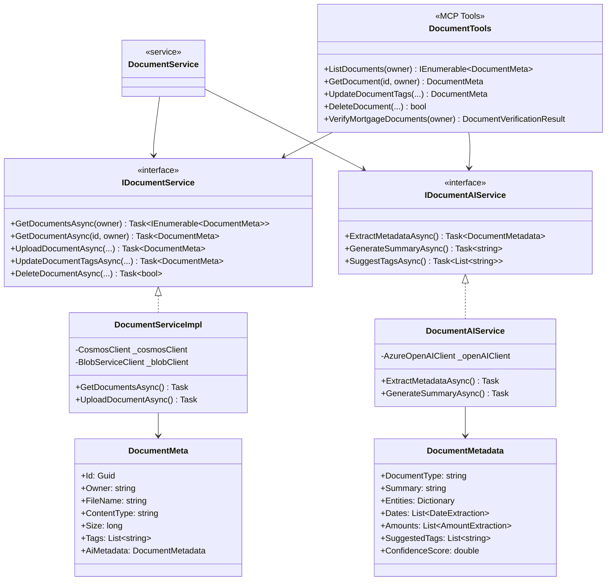

### LedgerService

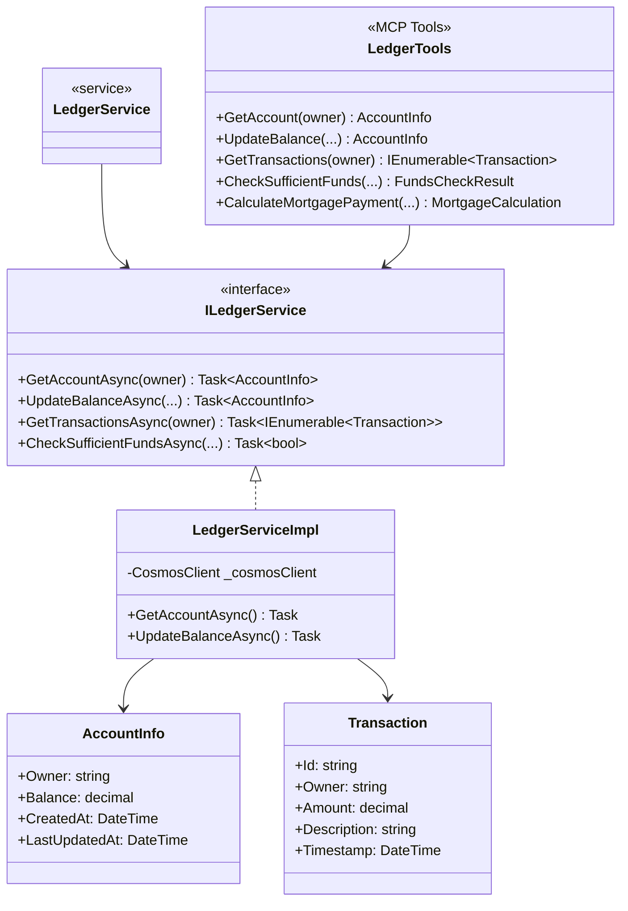

### MortgageApprover

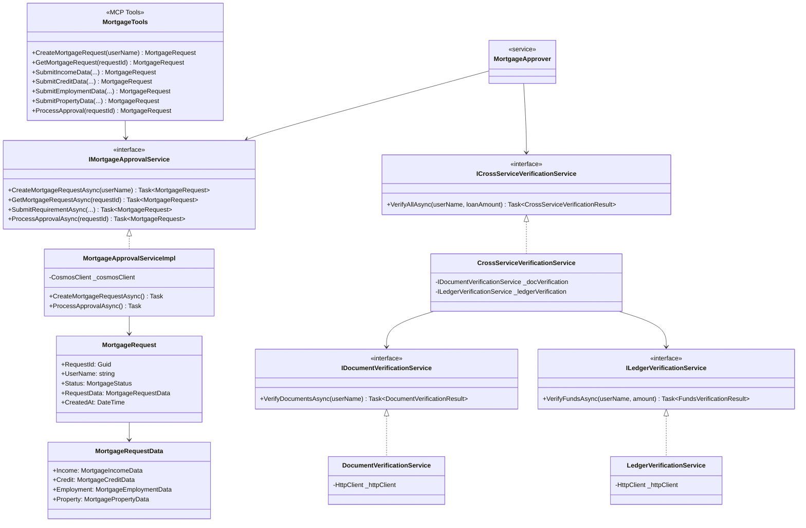

### CrmService

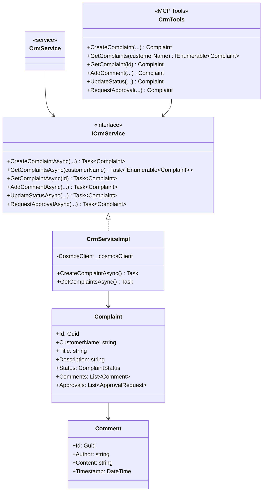

### AgentService

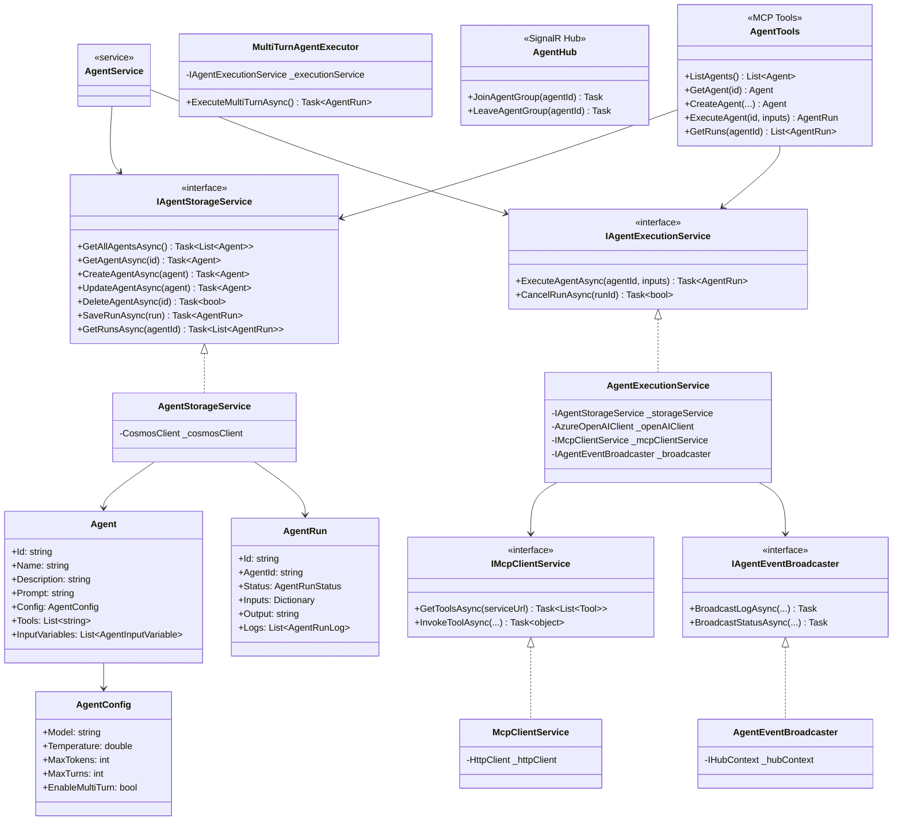

### Web Frontend

```mermaid
classDiagram
    class WebFrontend {
        <<Blazor Server>>
    }
    
    class DocumentApiClient {
        -HttpClient _httpClient
        +GetDocumentsAsync(owner) Task~List~DocumentMeta~~
        +UploadDocumentAsync(...) Task~DocumentMeta~
        +DeleteDocumentAsync(...) Task~bool~
    }
    
    class LedgerApiClient {
        -HttpClient _httpClient
        +GetAccountAsync(owner) Task~AccountInfo~
        +UpdateBalanceAsync(...) Task~AccountInfo~
        +GetTransactionsAsync(owner) Task~List~Transaction~~
    }
    
    class MortgageApiClient {
        -HttpClient _httpClient
        +CreateMortgageRequestAsync(userName) Task~MortgageRequest~
        +GetMortgageRequestAsync(requestId) Task~MortgageRequest~
        +SubmitRequirementAsync(...) Task~MortgageRequest~
    }
    
    class CrmApiClient {
        -HttpClient _httpClient
        +GetComplaintsAsync(customerName) Task~List~Complaint~~
        +CreateComplaintAsync(...) Task~Complaint~
        +AddCommentAsync(...) Task~Complaint~
    }
    
    class AgentApiClient {
        -HttpClient _httpClient
        +GetAgentsAsync() Task~List~Agent~~
        +ExecuteAgentAsync(id, inputs) Task~AgentRun~
        +GetRunsAsync(agentId) Task~List~AgentRun~~
    }
    
    class ToastService {
        +ShowSuccess(message) void
        +ShowError(message) void
        +ShowWarning(message) void
    }
    
    class BackgroundActivityService {
        +TrackActivity(...) Task
        +GetActiveActivities() List~Activity~
    }
    
    class IServiceUrlResolver {
        <<interface>>
        +ResolveUrlAsync(serviceName) Task~string~
    }
    
    class ServiceUrlResolver {
        -IConfiguration _configuration
    }
    
    class ErrorHandlingDelegatingHandler {
        +SendAsync() Task~HttpResponseMessage~
    }
    
    IServiceUrlResolver <|.. ServiceUrlResolver
    
    WebFrontend --> DocumentApiClient
    WebFrontend --> LedgerApiClient
    WebFrontend --> MortgageApiClient
    WebFrontend --> CrmApiClient
    WebFrontend --> AgentApiClient
    WebFrontend --> ToastService
    WebFrontend --> BackgroundActivityService
    WebFrontend --> IServiceUrlResolver
    
    DocumentApiClient --> ErrorHandlingDelegatingHandler
    LedgerApiClient --> ErrorHandlingDelegatingHandler
    MortgageApiClient --> ErrorHandlingDelegatingHandler
    CrmApiClient --> ErrorHandlingDelegatingHandler
    AgentApiClient --> ErrorHandlingDelegatingHandler
```

## Data Flow Diagrams

### Mortgage Approval Flow

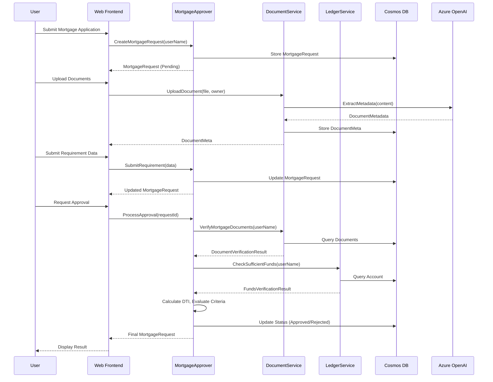

### AI Agent Execution Flow

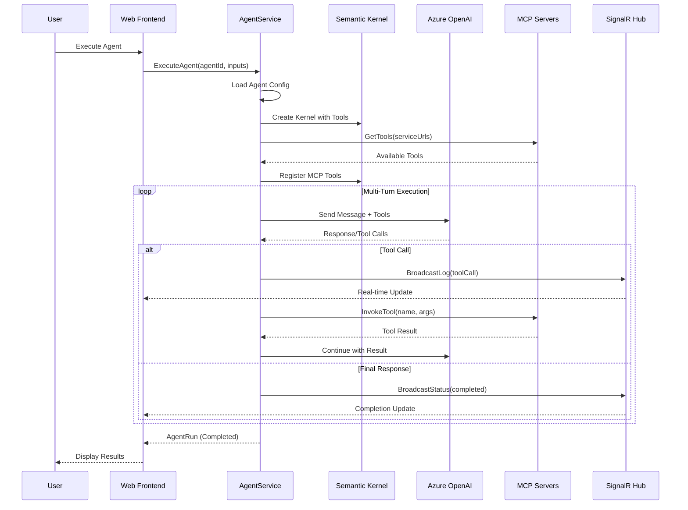

## External Dependencies

```mermaid
graph TB
    subgraph NuGet["📦 NuGet Packages"]
        subgraph Aspire["Aspire Integration"]
            AspireCosmos[Aspire.Microsoft.Azure.Cosmos]
            AspireBlobs[Aspire.Azure.Storage.Blobs]
            AspireOpenAI[Aspire.Azure.AI.OpenAI]
            ServiceDiscovery[Microsoft.Extensions.ServiceDiscovery]
            Resilience[Microsoft.Extensions.Http.Resilience]
        end
        
        subgraph AI["AI & ML"]
            AzureOpenAI[Azure.AI.OpenAI]
            SemanticKernel[Microsoft.SemanticKernel]
            SKAzureOpenAI[Microsoft.SemanticKernel.Connectors.AzureOpenAI]
        end
        
        subgraph MCP["Model Context Protocol"]
            MCPCore[ModelContextProtocol]
            MCPAspNet[ModelContextProtocol.AspNetCore]
        end
        
        subgraph Observability["Observability"]
            OTelExporter[OpenTelemetry.Exporter.OpenTelemetryProtocol]
            OTelAspNet[OpenTelemetry.Instrumentation.AspNetCore]
            OTelHttp[OpenTelemetry.Instrumentation.Http]
        end
        
        subgraph Web["Web & API"]
            OpenApi[Microsoft.AspNetCore.OpenApi]
            Scalar[Scalar.AspNetCore]
            SignalR[Microsoft.AspNetCore.SignalR]
        end
    end
    
    subgraph Services["Services"]
        DocSvc[DocumentService]
        LedgerSvc[LedgerService]
        MortgageSvc[MortgageApprover]
        CrmSvc[CrmService]
        AgentSvc[AgentService]
        WebFE[Web Frontend]
    end
    
    DocSvc --> AspireCosmos
    DocSvc --> AspireBlobs
    DocSvc --> AspireOpenAI
    DocSvc --> MCPAspNet
    
    LedgerSvc --> AspireCosmos
    LedgerSvc --> MCPAspNet
    
    MortgageSvc --> AspireCosmos
    MortgageSvc --> MCPAspNet
    
    CrmSvc --> AspireCosmos
    CrmSvc --> MCPAspNet
    
    AgentSvc --> AspireCosmos
    AgentSvc --> AzureOpenAI
    AgentSvc --> SemanticKernel
    AgentSvc --> SKAzureOpenAI
    AgentSvc --> MCPCore
    AgentSvc --> SignalR
    
    WebFE --> SignalR
```

## Cosmos DB Data Model

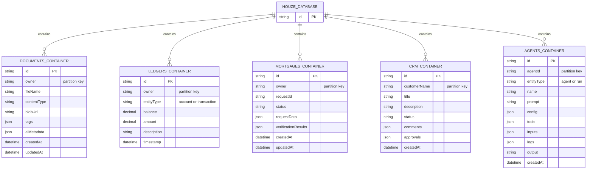

## MCP (Model Context Protocol) Architecture

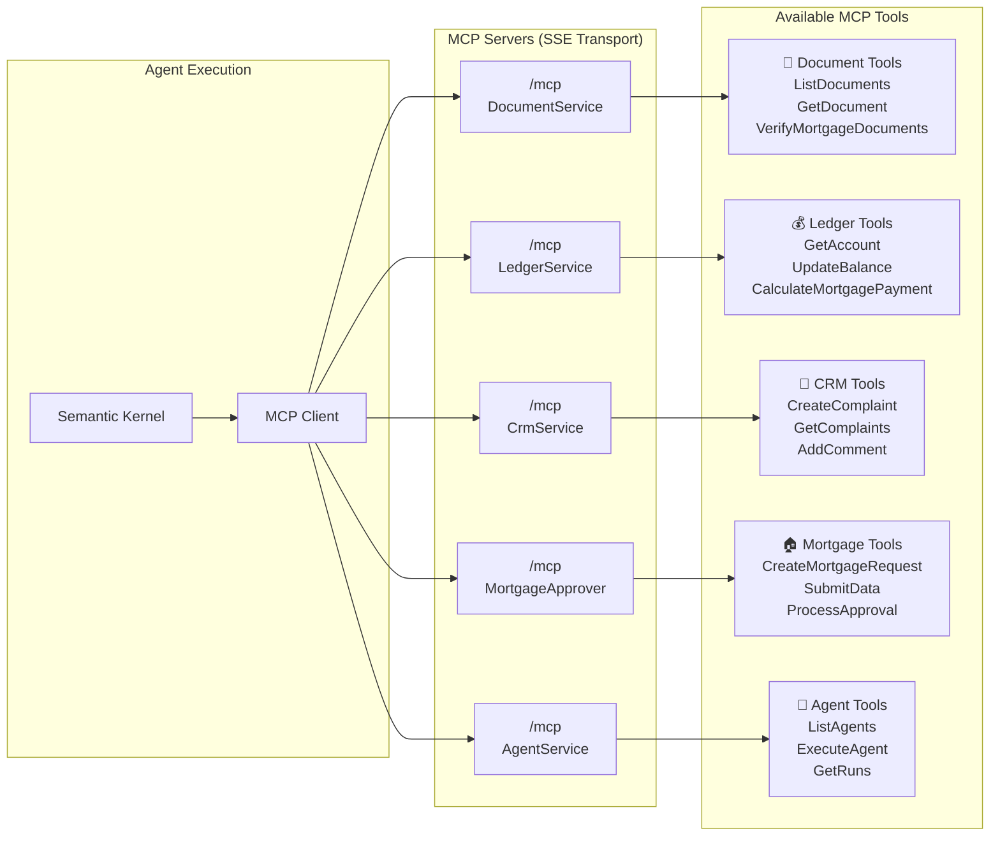

## Deployment Architecture

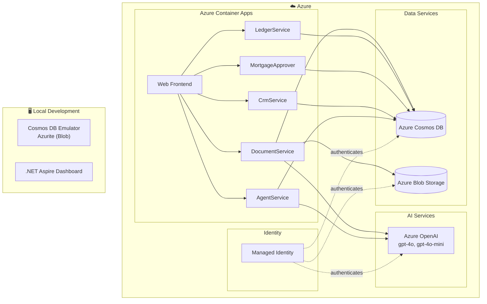

## Key Technologies Summary

| Component | Technology | Purpose |
|-----------|------------|---------|
| **Framework** | .NET 9.0 | Core runtime |
| **Orchestration** | .NET Aspire 9.3.1 | Service orchestration & local dev |
| **Frontend** | Blazor Server | Interactive web UI |
| **Database** | Azure Cosmos DB | Document storage |
| **File Storage** | Azure Blob Storage | Document file storage |
| **AI** | Azure OpenAI (GPT-4o) | Document analysis & agent execution |
| **AI Framework** | Semantic Kernel | LLM orchestration for agents |
| **API Protocol** | Model Context Protocol (MCP) | Tool-based AI integration |
| **Real-time** | SignalR | WebSocket communication |
| **Observability** | OpenTelemetry | Metrics, traces, logging |
| **API Docs** | Scalar + OpenAPI | API documentation |
| **Deployment** | Azure Container Apps | Production hosting |
| **Auth** | DefaultAzureCredential | Keyless authentication |
